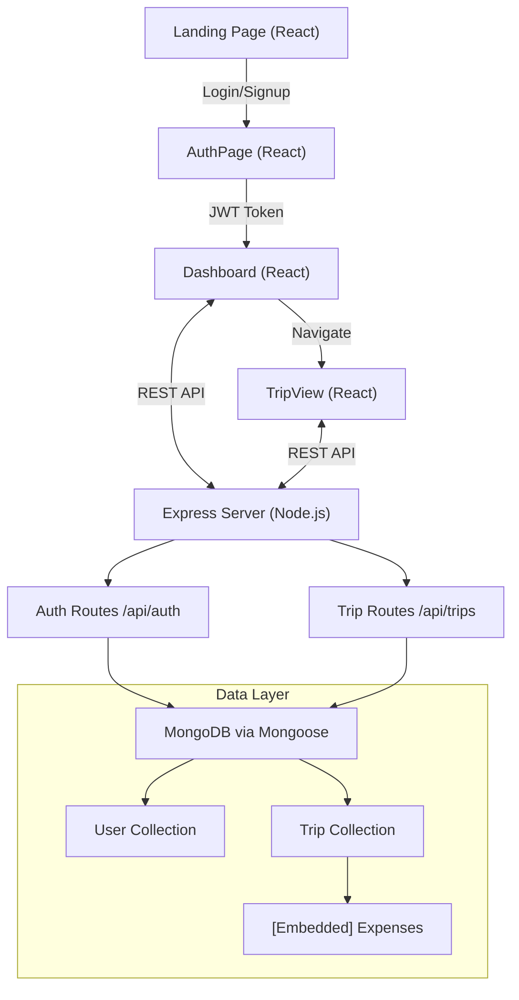

# Product Requirements Document (PRD)
## TripSplit ✈️ — Shared Expense Tracker

**Version:** 1.0  
**Date:** April 2026  
**Author:** Engineering  
**Status:** Living Document

---

## 1. Executive Summary

TripSplit is a full-stack MERN web application that eliminates the friction of tracking shared expenses within friend groups, roommates, and travel parties. Users create named "Group Workspaces" (e.g., *Goa Weekend*, *Apartment Bills*), add participants, log expenses with flexible split modes, and receive an automatically computed debt-settlement summary — telling each person precisely how much to pay and to whom. The application replaces manual spreadsheets with a real-time, mobile-optimized dashboard backed by a secure JWT-authenticated REST API.

---

## 2. Product Vision & Goals

| Goal | Description |
|---|---|
| **Simplicity** | Any user should be able to log an expense and understand their balance in under 30 seconds |
| **Accuracy** | Zero rounding errors in settlement calculations; every rupee must balance |
| **Trustworthy Data** | Expenses are server-persisted with full CRUD, not ephemeral local state |
| **Security** | All group data gated behind authenticated sessions; no data leakage between users |
| **Extensibility** | Modular architecture enabling future features (receipt scanning, notifications, multi-currency) |

---

## 3. Target Personas

### 3.1 The Trip Organizer
> *"I'm always the one paying upfront on trips. I need to track who owes me without asking people awkwardly."*

- Creates and owns a Group Workspace
- Adds all members and logs most expenses
- Primarily uses the Settlement Summary to know who to chase

### 3.2 The Group Member
> *"I just want to know what I owe at the end of the trip, not micromanage every transaction."*

- Joins an existing group (currently via owner add)
- Views the dashboard settlement cards
- May log expenses they paid for

### 3.3 The Roommate
> *"We split bills every month — electricity, groceries, rent. I need history I can scroll back through."*

- Creates a persistent group that lives beyond a single event
- Relies on the expense history log
- Needs unequal splits (e.g., bigger room → higher share)

---

## 4. Application Architecture



### Tech Stack

| Layer | Technology | Version |
|---|---|---|
| Frontend Framework | React | 19.x |
| Client Build Tool | Vite | 8.x |
| Client Routing | React Router DOM | 7.x |
| Styling | Tailwind CSS | 4.x |
| Animations | GSAP + Lenis | 3.x / 1.x |
| Backend Server | Express.js | 5.x |
| Runtime | Node.js | LTS |
| Database | MongoDB (via Mongoose) | 9.x ORM |
| Auth | JWT (jsonwebtoken) | 9.x |
| Password Hashing | bcrypt | 6.x |

---

## 5. Application Routes (Frontend)

| Route | Component | Access |
|---|---|---|
| `/` | `LandingPage.jsx` | Public |
| `/login` | `AuthPage (isLogin=true)` | Public |
| `/signup` | `AuthPage (isLogin=false)` | Public |
| `/dashboard` | `Dashboard.jsx` | Protected (JWT) |
| `/trips/:tripId` | `TripView.jsx` | Protected (JWT) |

---

## 6. Data Models

### 6.1 User

```
User {
  _id:        ObjectId (auto)
  name:       String (required)
  email:      String (required, unique)
  password:   String (bcrypt-hashed, required)
  createdAt:  Date (auto)
  updatedAt:  Date (auto)
}
```

### 6.2 Trip (Group Workspace)

```
Trip {
  _id:       ObjectId (auto)
  name:      String (required)
  owner:     ObjectId → User (required)
  members:   [String]           // Display names, not User refs
  expenses:  [Expense]          // Embedded sub-documents
  createdAt: Date (auto)
  updatedAt: Date (auto)
}

Expense {
  _id:         ObjectId (auto)
  description: String (required)
  amount:      Number (required)
  payer:       String (required) // Must be in members[]
  shares:      Map<String, Number> // member → share amount
}
```

> [!NOTE]
> Members are stored as plain name strings (`String[]`), not as references to `User` documents. This enables inviting non-registered participants by name.

---

## 7. API Surface

All trip routes require `Authorization: Bearer <token>` header.

### Authentication

| Method | Endpoint | Description | Auth |
|---|---|---|---|
| `POST` | `/api/auth/register` | Create new user account | None |
| `POST` | `/api/auth/login` | Login, receive JWT (7-day expiry) | None |

**Register payload:** `{ name, email, password }`  
**Login payload:** `{ email, password }`  
**Login response:** `{ token, user: { id, name, email } }`

---

### Trip Management

| Method | Endpoint | Description |
|---|---|---|
| `GET` | `/api/trips` | Get all trips owned by authenticated user |
| `POST` | `/api/trips` | Create a new trip `{ name }` |
| `GET` | `/api/trips/:tripId` | Get trip details + computed settlements |
| `POST` | `/api/trips/:tripId/members` | Add member by name `{ name }` |
| `DELETE` | `/api/trips/:tripId/members` | Remove member by name `{ name }` (blocked if involved in expense) |
| `POST` | `/api/trips/:tripId/expenses` | Add expense `{ description, amount, payer, shares }` |
| `DELETE` | `/api/trips/:tripId/expenses/:expenseId` | Delete specific expense |

---

## 8. Core Features (Current — v1.0)

### 8.1 Authentication System
- **Register:** Name, email, password → bcrypt-hashed storage
- **Login:** Email + password → JWT with 7-day expiry
- **Session persistence:** Token stored in `localStorage`
- **Auto-redirect:** Unauthenticated users bounced to `/login`
- **Logout:** Clears `localStorage` token and name

### 8.2 Group Workspace Management
- Create named group workspaces from the Dashboard
- Sidebar navigation listing all owned groups
- Search/filter groups by name on the dashboard
- Masonry-grid layout showing expense/settlement previews per group
- Toggle between "Expenses" and "Settlements" view on dashboard cards

### 8.3 Member Management (within a Group)
- Add members by display name (free-text, not requiring registration)
- Remove members — blocked if they appear in any expense as payer or share recipient
- Member tags displayed as pills/chips in the TripView
- Member list feeds payer dropdown in expense form

### 8.4 Expense Engine
- Log expenses with: **description**, **total amount (₹)**, **payer**
- **Equal Split Mode:** Select which members are involved; amount divided equally among checked members; shows per-person cost live
- **Unequal (Exact) Split Mode:** Manually input each member's exact share amount; live validation showing remaining/over amounts; submit blocked until shares balance to total
- Delete individual expenses from the history log
- Expense history shown in reverse-chronological order

### 8.5 Settlement Calculator
- **Algorithm:** Greedy two-pointer debt settlement
  1. Compute net balance per member (amount paid − amount owed)
  2. Separate into `creditors` (net positive) and `debtors` (net negative)
  3. Sort both lists descending by amount
  4. Greedily match largest debtor to largest creditor until all balanced
  5. Output: minimum set of transactions to settle all debts
- Settlements computed **server-side** on `GET /api/trips/:tripId` and **also client-side** in Dashboard for preview cards (via `utils/calculations.js`)
- Settlements displayed as: `[Debtor] → ₹X.XX → [Creditor]`
- "All settled up!" confirmation state when no outstanding balances

### 8.6 Landing Page
- Fully styled marketing landing page at `/`
- Built with GSAP animations + Lenis smooth scroll
- Sections: Hero, Feature Grid, "Why TripSplit", About Us
- CTA buttons linking to `/signup` and `/login`

---

## 9. Non-Functional Requirements

### 9.1 Performance
- Vite build tooling for fast HMR in development
- Expense list capped with `overflow-y-auto` + `max-h` to prevent layout overflow
- Settlements computed with O(n log n) greedy algorithm

### 9.2 Security
- Passwords are bcrypt-hashed (salt rounds: 10) — never stored in plaintext
- JWT signed with `JWT_SECRET` env variable (falls back to a default for dev)
- All `/api/trips` routes guarded by `auth` middleware token verification
- CORS configured on the Express server
- Trip data scoped to owner: `Trip.find({ owner: req.user.userId })`

### 9.3 Responsiveness
- Tailwind CSS responsive breakpoints (`md:`, `lg:`, `xl:`)
- Dashboard masonry grid adapts: 1 col (mobile) → 2 col (tablet) → 3 col (desktop)
- TripView layout: single column (mobile) → two-column grid (large screens)
- AuthPage: full-screen split-panel on desktop, single-column form on mobile

### 9.4 Deployment
- Frontend configured for Render/static hosting (`prep_for_render.js`)
- `VITE_API_URL` env variable controls backend endpoint; falls back to `http://localhost:5000`
- Backend `.env` houses `MONGO_URI` and `JWT_SECRET`

---

## 10. Known Limitations & Technical Debt

> [!WARNING]
> The following are gaps in the current v1.0 implementation that should be addressed before a production launch.

| # | Issue | Impact | Priority |
|---|---|---|---|
| 1 | **No route guards** — `/dashboard` and `/trips/:id` are accessible by URL even without a valid token if the fetch fails silently | Security / UX | High |
| 2 | **Members are not linked to User accounts** — members are name strings; no way to give a member access to view their own dashboard | Core UX | High |
| 3 | **Only the owner can see their trips** — `GET /api/trips` only returns trips where `owner == userId`, so a trip member who registered cannot see groups they were added to | Core UX | High |
| 4 | **JWT_SECRET insecure fallback** — falls back to `'tripsplit_secret_key'` if env var is not set | Security | High |
| 5 | **No input sanitization** — member names and expense descriptions are stored as-is; no XSS prevention beyond React's default escaping | Security | Medium |
| 6 | **`alert()` used for error messages** — native browser alerts instead of in-app toast/notification UI | UX | Medium |
| 7 | **No pagination** — all trips and all expenses are loaded at once; will degrade with large datasets | Performance | Medium |
| 8 | **Currency hardcoded to ₹ (INR)** — no multi-currency support | Feature Gap | Medium |
| 9 | **No expense editing** — only add and delete; no update flow | Feature Gap | Low |
| 10 | **No confirmation dialogs** — delete expense has no "are you sure?" step | UX | Low |
| 11 | **`mongoose-memory-server` listed as prod dependency** — should be devDependency only | Hygiene | Low |
| 12 | **Calculator.html prototype** — standalone static HTML expense calculator exists in root; not integrated into the React app | Hygiene | Low |

---

## 11. Roadmap — Future Enhancements

### Phase 2 — Core Completeness

- [ ] **Member-to-User account linking:** Allow members to register and be linked via email, giving them access to shared trips
- [ ] **Shared trip visibility:** Members (not just owners) can view and manage trips they've been added to
- [ ] **Route protection:** Implement a `<ProtectedRoute>` wrapper component that validates token existence and redirectness unauthenticated users
- [ ] **Toast notification system:** Replace all `alert()` calls with a sleek in-app toast notification component
- [ ] **Expense editing:** Allow modifying description, amount, and shares for existing expenses
- [ ] **Confirmation dialogs:** Modal confirm before deleting expenses or removing members

### Phase 3 — Enhanced Experience

- [ ] **Multi-currency support:** Log expenses in different currencies with conversion at time of entry
- [ ] **Receipt upload / OCR:** Upload a photo of a receipt; auto-parse amount and description
- [ ] **Date & category tags:** Attach dates and categories (🍕 Food, 🏨 Hotel, 🚌 Transport) to expenses for better filtering
- [ ] **Trip summary export:** Export expense history and settlement summary as PDF or CSV
- [ ] **Push/email notifications:** Notify members when a new expense is added or when they owe money

### Phase 4 — Social & Scale

- [ ] **Group invitations via link:** Generate a shareable invite link or QR code to join a group
- [ ] **"Settle up" mark-as-paid:** Mark individual settlement transactions as paid; track full settlement history
- [ ] **Activity feed:** Real-time or polled activity log showing who added/removed what and when
- [ ] **Mobile app (React Native):** Extend the product to native iOS/Android using the existing REST API

---

## 12. File & Component Inventory

```
TripSplit/
├── client/                        # React + Vite SPA
│   ├── src/
│   │   ├── components/
│   │   │   ├── LandingPage.jsx    # Marketing landing page (GSAP, Lenis)
│   │   │   └── AuthPage.jsx       # Shared Login & Signup page
│   │   ├── pages/
│   │   │   ├── Dashboard.jsx      # Authenticated home: group list + previews
│   │   │   └── TripView.jsx       # Full group detail: members, expenses, settlements
│   │   ├── utils/
│   │   │   └── calculations.js    # Client-side settlement algorithm (mirrors server)
│   │   ├── App.jsx                # React Router configuration
│   │   └── main.jsx               # React entry point
│   ├── public/
│   │   ├── split.gif              # Auth page hero animation
│   │   └── user.png               # Default user avatar
│   ├── tailwind.config.js
│   └── vite.config.js
│
├── server/                        # Express REST API
│   ├── controllers/
│   │   └── tripController.js      # CRUD + settlement algorithm (server-side)
│   ├── middleware/
│   │   └── auth.js                # JWT verification middleware
│   ├── models/
│   │   ├── User.js                # Mongoose User schema
│   │   └── Trip.js                # Mongoose Trip + Expense schema
│   ├── routes/
│   │   ├── auth.js                # /api/auth (register, login)
│   │   └── trips.js               # /api/trips (all CRUD)
│   ├── server.js                  # Express app setup + route mounting
│   └── .env                       # MONGO_URI, PORT, JWT_SECRET
│
├── calculator.html                # [PROTOTYPE] Standalone static expense calculator
└── README.md
```

---

## 13. Development Setup

### Prerequisites
- Node.js (LTS)
- MongoDB instance (local or Atlas URI)

### Start Backend
```bash
cd server
npm install
npm start          # Starts on PORT 5000 by default
```

### Start Frontend
```bash
cd client
npm install
npm run dev        # Starts Vite dev server on http://localhost:5173
```

### Environment Variables
```bash
# server/.env
MONGO_URI=mongodb://localhost:27017/tripsplit
JWT_SECRET=your_strong_secret_here
PORT=5000
```

---

*TripSplit — Designed and engineered in 2026 to simplify shared experiences.*
